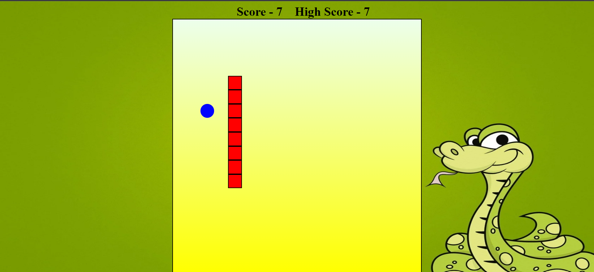

# Created a Snake Game using HTML, CSS and Javascript.

# Link of Snake game - https://rahulgit24.github.io/Snake-Game/

<h3> This game can be played by the arrow keys of your keyboard</h3>

<h3> It works quite well on mobile phones and various other devices as it is responsive.</h3>

<h3> The snake speed increases after every 5 points</h3>

<h3> Highscore is stored in localstorage</h3>

<h3> Highscore is updated as you playing the game</h3>

# Working of this Project

<h3> You can follow me on Instagram for various projects on web development and basic DSA questions</h3>

